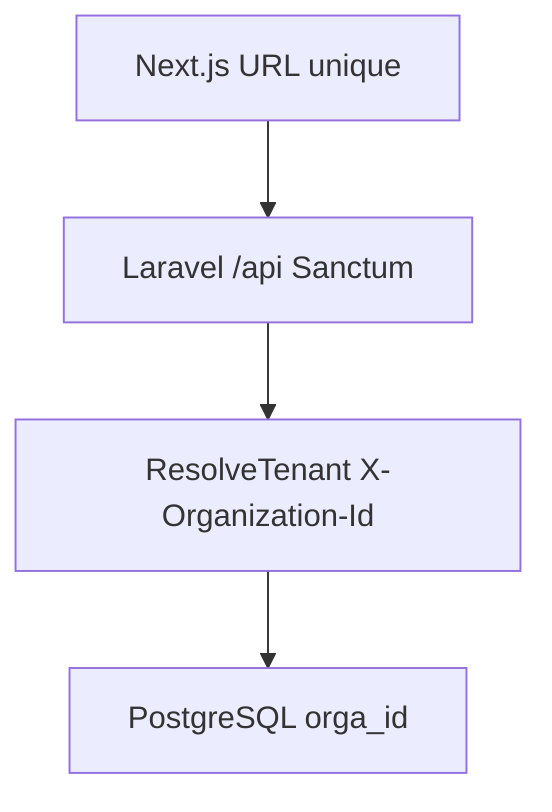

# Laravel backend (source de vérité)

## Principe : une URL, des tenants via session + header

**Tous les clients utilisent la même URL** (ex. `https://app.invomind.com`).  
Pas de sous-domaine ni de préfixe de path pour le tenant.

### Front (Next.js)

Deux cookies HttpOnly :

- `invomind_session` — JWT signé `{ userId, organizationId, role, expiresAt }` (**sans** token Sanctum)
- `invomind_access` — Bearer Sanctum (cookie séparé)

Flux dashboard :

1. `proxy.ts` vérifie le cookie session (`userId` + `organizationId`)
2. `verifySession()` appelle `GET /api/auth/me` avec Bearer + `X-Organization-Id`
3. `lib/dal/*` et `lib/actions/*` appellent Laravel via `lib/laravel/client.ts`

### Backend (Laravel)

- Une **seule base** PostgreSQL ; isolation par colonne `orga_id`
- Tables métier en **français** (`factures`, `devis`, `clients`, …)
- Chemins HTTP en **anglais** (`/invoices`, `/quotes`, …)
- Champs JSON en **snake_case français** (`montant_total`, `date_echeance`, `categorie_client`)
- Auth : **Sanctum** personal access tokens
- Middleware `auth:sanctum` + `tenant` (`ResolveTenant`) : lit `X-Organization-Id` (doit correspondre à `user.orga_id`)
- Admin : middleware `admin` (rôle `admin` uniquement ; agents exclus)



## Flags front

```env
USE_LARAVEL_API=true
LARAVEL_API_URL=http://localhost:8000/api
LARAVEL_TIMEOUT_MS=10000
```

Si `USE_LARAVEL_API=false`, le front retombe sur `lib/mock/*` (démo locale uniquement).

## Couches front → Laravel

| Front | Laravel |
|-------|---------|
| `lib/dal/*` | `GET` JSON |
| `lib/actions/*` | `POST` / `PUT` / `DELETE` |
| `lib/laravel/enums.ts` | Maps FR ↔ EN (statuts, paiements, catégories) |
| `lib/laravel/payloads.ts` | Bodies snake_case FR pour les écritures |
| `lib/laravel/mappers.ts` | Réponses FR → types UI camelCase |
| `lib/billing/entitlements.ts` | `GET /organization/entitlements` |

## Contrat API (réel — `backend/routes/api.php`)

Préfixe : `/api`. Auth Bearer + `X-Organization-Id` sauf routes publiques.

### Auth (public)

| Méthode | Path |
|---------|------|
| POST | `/auth/register` — crée org + user `admin` + abonnement `gratuit` |
| POST | `/auth/login` |
| POST | `/auth/forgot-password` |
| POST | `/auth/reset-password` |
| GET | `/auth/email/verify/{id}/{hash}` (signed) |
| POST | `/auth/email/resend` |

### Auth (Sanctum)

| Méthode | Path |
|---------|------|
| POST | `/auth/logout` |
| GET | `/auth/me` |

### Organisation & billing (tenant)

| Méthode | Path | Accès |
|---------|------|-------|
| GET | `/organization` | membre |
| GET | `/organization/entitlements` | membre |
| PUT | `/organization` | **admin** — `name_company`, `adresse`, `ville`, `pays`, `devise_defaut`, `logo_url`, … |
| POST | `/billing/change-plan` | **admin** (plans gratuits) |
| POST | `/billing/checkout` | **admin** (501 tant que CinetPay SaaS non branché) |
| POST | `/billing/cancel` | **admin** |

### Métier

| Ressource | Paths |
|-----------|-------|
| Clients | `GET/POST /clients`, `GET/PUT/DELETE /clients/{id}` — champ `categorie_client` |
| Devis | `GET/POST /quotes`, `GET/PUT /quotes/{id}`, `PUT …/status`, `POST …/convert` |
| Factures | `GET/POST /invoices`, `GET/PUT /invoices/{id}`, `PUT …/status` |
| Paiements | `GET/POST /payments` — body `facture_id`, `montant`, `mode_paiement` |
| Dépenses | `GET/POST /expenses`, `PUT /expenses/{id}`, `GET /expense-categories` |
| Catalogue | `GET/POST /catalog`, `PUT /catalog/{id}` — `prix_unitaire`, `type` (`produit`\|`service`) |
| Agents | `GET/POST /agents`, `PUT /agents/{id}/enable\|disable` — **admin** |
| Reports | `GET /reports/dashboard`, `GET /reports/overview` — **admin** |

Listes : sans `per_page` → tableau nu (ou Resource collection) ; avec `?page=&per_page=` (max 100) → `{ data, meta }`. Le BFF accepte les deux via `unwrapList()`.

### Portail (public, token = `factures.uuid`)

| Méthode | Path | Notes |
|---------|------|-------|
| GET | `/portal/{token}` | `InvoiceResource` nu |
| POST | `/portal/{token}/checkout` | CinetPay |
| GET | `/portal/{token}/pdf` | **501** (pas encore reconnecté) |
| GET | `/portal/{token}/receipt.pdf` | **501** |
| POST | `/portal/{token}/pay` | **410** — utiliser checkout |

### Webhooks

| Path | Usage |
|------|-------|
| `GET/POST /webhooks/cinetpay` | Paiements factures (direct Laravel) |

### Non exposé (UI « Bientôt disponible »)

Pas de routes pour : avoirs, import CSV, PDF dashboard (`/documents/{id}/pdf`), sous-routes `/organization/settings|tax|banking|…`, invitations, email-templates, prospects séparés.

### Messagerie omnicanale

Voir [MESSAGERIE.md](./MESSAGERIE.md). Routes : `/conversations`, `/inboxes`, `/labels`, `/webhooks/meta`, `/webhooks/tiktok`. Entitlement `conversations` : **true** (tous plans, surchargable via `plans.fonctionnalites`).

Le Kanban clients utilise `clients.categorie_client` (`prospect`, `qualifie`, `negociation`, `client`, `inactif`) — ce n’est **pas** un module entitlements.

## Enums PostgreSQL (valeurs API)

| Domaine | Valeurs |
|---------|---------|
| `devis_statut` | `brouillon`, `envoye`, `accepte`, `refuse`, `expire`, `converti` |
| `facture_statut` | `brouillon`, `envoyee`, `payee`, `partiellement_payee`, `impayee`, `en_retard`, `annulee` |
| `mode_paiement_enum` | `cash`, `virement`, `carte`, `orange_money`, `mtn_money`, `moov_money`, `wave`, `cheque`, `autre` |
| `client_categorie` | `prospect`, `qualifie`, `negociation`, `client`, `inactif` |
| `produit_type` | `produit`, `service` |
| `user_role` | `admin`, `agent` |
| Plans | `gratuit`, `pro`, `business` (`plan_id` auth peut mapper `gratuit` → `free` côté session) |

## Auth (réponse login / me)

```json
{
  "user": { "id": "1", "uuid": "…", "email": "…", "full_name": "…", "name": "…", "role": "admin", "is_active": true },
  "organization_id": "1",
  "organization": {
    "id": "1",
    "uuid": "…",
    "name": "…",
    "name_company": "…",
    "plan_id": "free",
    "plan_code": "gratuit",
    "devise_defaut": "XOF"
  },
  "role": "admin",
  "token": "…"
}
```

`token` est omis sur `GET /auth/me`. Rôles Laravel : **`admin` | `agent`** (plus de `owner` / `member` en production).

## Entitlements

`GET /organization/entitlements` :

- Quotas factures / clients / agents selon le plan
- `pipeline` : `true` (Kanban = `categorie_client`)
- `conversations` : `true` (module messagerie omnicanale — voir [MESSAGERIE.md](./MESSAGERIE.md))
- `expenses`, `catalog`, `reports` : `true`
- `import_tool` : `true` si plan ≠ `gratuit` (mais **aucune route** `/import` pour l’instant)

## Queue, scheduler, mail

Queue **database**. Depuis `backend/` :

```bash
php artisan queue:work
php artisan schedule:work
```

Mail : `MAIL_MAILER=log` en local ; `resend` en prod (`RESEND_API_KEY`).

## CinetPay

```
POST /portal/{uuid}/checkout
GET|POST /api/webhooks/cinetpay
POST /billing/checkout   # SaaS — 501 si non branché
```

Env Laravel : `CINETPAY_*`, `PSP_DRIVER=fake` pour tests.

## Mapping BFF (référence)

| UI | API |
|----|-----|
| `draft` / `sent` / `paid` | `brouillon` / `envoyee` / `payee` |
| `card` / `transfer` / `check` | `carte` / `virement` / `cheque` |
| `product` / `service` | `produit` / `service` |
| Pipeline stages | = `categorie_client` |
| `portalToken` | `uuid` de la facture |
| Conversion devis | `POST /quotes/{id}/convert` |
| `amountHt` / `amountTtc` (dépense) | `montant_ht` / `montant_ttc` |
| `paymentTermDays` / `taxId` | `delai_paiement_jours` / `numero_fiscal` |
| `amountPaid` / `balanceDue` | `montant_paye` / `balance_due` |
| CA encaissé / profit | Σ paiements / Σ paiements − dépenses TTC validées |

Contrat détaillé : [superpowers/specs/2026-09-05-modele-metier-financier.md](./superpowers/specs/2026-09-05-modele-metier-financier.md).
