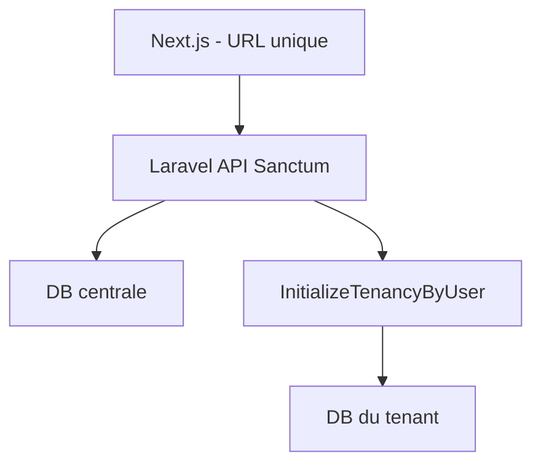

# Laravel backend (multi-tenant, URL unique)

Le front Next.js tourne en **mocks multi-tenant** :

- **Central** : [`lib/mock/central.ts`](../lib/mock/central.ts) — tenants, users, memberships, plans, subscriptions, channelConnections
- **Par tenant** : [`lib/mock/store.ts`](../lib/mock/store.ts) — une « base » isolée (`Map<tenantId, MockStore>`), comme une DB dédiée

## Flag

```env
NEXT_PUBLIC_USE_MOCK_DATA=true   # défaut — mocks
# NEXT_PUBLIC_USE_MOCK_DATA=false  # plus tard : client HTTP Laravel
```

## Architecture cible (stancl/tenancy)



### Base centrale

Tables : `tenants`, `users`, `tenant_user` (memberships + role), `plans`, `subscriptions`, `channel_connections`.

### Base par tenant

Tout le métier : clients, documents, payments, expenses, catalog, conversations, prospects, org_settings, branding, enabled_modules, webhooks logs.

Création à l’inscription via job `CreateDatabase` / `MigrateDatabase` (stancl).

### Résolution du tenant — pas de sous-domaine

Middleware custom **`InitializeTenancyByUser`** :

1. Auth Sanctum → user
2. Lire `organization_id` / `tenant_id` depuis la session (ou `last_tenant_id`)
3. `tenancy()->initialize($tenant)`

C’est ce qui garantit **une seule URL SaaS** pour tous les clients.

## Couches front → Laravel

| Front actuel | Laravel |
|--------------|---------|
| `lib/mock/central.ts` | Models + migrations central |
| `lib/mock/store.ts` + `tenantStore()` | Models tenant + tenancy scope |
| `lib/dal/*` | `GET` JSON Sanctum |
| `lib/actions/*` | `POST/PUT/PATCH/DELETE` |
| `lib/auth/session.ts` | Sanctum SPA cookie |
| `lib/billing/entitlements.ts` | Policy / middleware plan |
| `lib/webhooks/store.ts` | Queues + tables tenant |

## Contrat API (indicatif)

- `POST /api/register` → crée tenant DB + user + membership owner + sub free + session
- `POST /api/login` → session + `{ user, organization, plan }`
- `GET /api/clients`, `POST /api/clients`, … (toujours dans le contexte tenancy)
- `PATCH /api/organization/branding`, `PATCH /api/organization/modules`
- `POST /api/billing/change-plan`, `POST /api/billing/cancel`
- Portail public `GET /api/portal/{token}` : résolution tenant par token (équivalent `findTenantIdByPortalToken`)
- Webhooks Meta/TikTok : résolution via `channel_connections.external_id`

## Auth mock actuelle

- Démo : `lea@atelier-diallo.sn` / `password123` → org Atelier Diallo (données seed)
- Inscription : crée un **nouveau** tenant + store vide (isolation réelle entre orgs)
- Cookie JWT local (`invomind_session`) avec `userId` + `organizationId`
