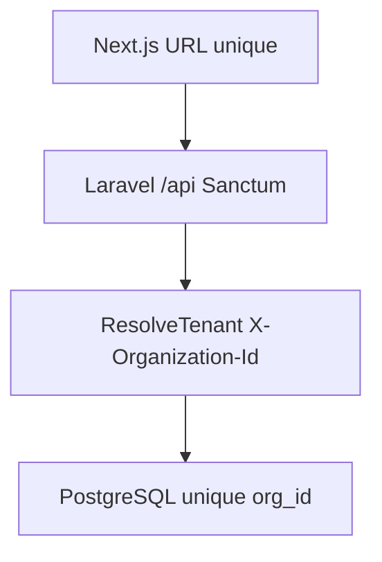

# Laravel backend (source de vérité)

## Principe : une URL, des tenants via session + header

**Tous les clients utilisent la même URL** (ex. `https://app.invomind.com`).  
Pas de sous-domaine ni de préfixe de path pour le tenant.

### Front (Next.js)

Deux cookies HttpOnly :

- `invomind_session` — JWT signé `{ userId, organizationId, role, expiresAt }` (**sans** token Sanctum)
- `invomind_access` — Bearer Sanctum (cookie séparé)

Flux dashboard :

1. `proxy.ts` vérifie le cookie session (`userId` + `organizationId`)
2. `verifySession()` appelle `GET /api/auth/me` avec Bearer + `X-Organization-Id`
3. `lib/dal/*` et `lib/actions/*` appellent Laravel via `lib/laravel/client.ts`

### Backend (Laravel)

- Une **seule base** ; isolation par colonne `organization_id`
- Auth : **Sanctum** personal access tokens
- Middleware `auth:sanctum` + `tenant` (`ResolveTenant`) : lit `X-Organization-Id` (sinon première membership)
- Admin : middleware `admin` (rôles `owner` | `admin`)



## Flags front

```env
USE_LARAVEL_API=true                 # source de vérité (recommandé)
LARAVEL_API_URL=http://localhost:8000/api
NEXT_PUBLIC_USE_MOCK_DATA=false      # désactiver les mocks en mode Laravel
```

Si `USE_LARAVEL_API=false`, le front retombe sur `lib/mock/*` (démo locale uniquement).

## Entitlements & modules

- `GET /organization/entitlements` est la source des quotas et flags plan ∩ org (pipeline, conversations, reports, expenses, catalog, import_tool).
- Front : `lib/billing/entitlements.ts` + `getCurrentOrganization().features`.
- Sidebar / FeatureGate utilisent `features` (intersection), pas seulement les toggles org.
- Plans Free / Pro / Business : 5 factures & 10 clients (Free), Pro 9 900 XOF, import CSV dès Pro.

## Couches front → Laravel

| Front | Laravel |
|-------|---------|
| `lib/dal/*` | `GET` JSON |
| `lib/actions/*` | `POST` / `PUT` / `DELETE` |
| `lib/laravel/mappers.ts` | snake_case → camelCase (y compris BFF conversations) |
| `lib/billing/entitlements.ts` | `GET /organization/entitlements` (+ garde-fous UI) |
| Cookies session | JWT session + Bearer Sanctum séparé |

## Contrat API (réel)

Préfixe : `/api`. Auth Bearer + `X-Organization-Id` sauf routes publiques.

### Auth (public)

| Méthode | Path |
|---------|------|
| POST | `/auth/register` — 201 + `email_verification_required` (pas de token) |
| POST | `/auth/login` |
| POST | `/auth/forgot-password` |
| POST | `/auth/reset-password` |
| POST | `/auth/invitations/accept` |
| GET | `/auth/email/verify/{id}/{hash}` (signed) |
| POST | `/auth/email/resend` |

### Auth (Sanctum)

| Méthode | Path |
|---------|------|
| POST | `/auth/logout` |
| GET | `/auth/me` |

### Organisation (tenant)

| Méthode | Path | Notes |
|---------|------|-------|
| GET | `/organization` | |
| GET | `/organization/entitlements` | |
| PUT | `/organization/settings\|tax\|banking\|reminders\|payments\|branding\|modules` | admin |
| GET/POST | `/organization/invitations` | admin |
| DELETE | `/organization/invitations/{id}` | admin — révoquer |

### Métier

| Ressource | Paths |
|-----------|-------|
| Clients | `GET/POST /clients`, `GET/PUT/DELETE /clients/{id}` |
| Documents | `GET/POST /documents`, `GET/PUT /documents/{id}`, `PUT …/status` (devis), `POST …/issue`, `…/send`, `GET …/pdf` |
| Prospects | `GET/POST /prospects`, `PUT /prospects/{id}/stage` |
| Expenses | `GET/POST /expenses`, `PUT /expenses/{id}`, `GET /expense-categories` |
| Payments | `GET/POST /payments` |
| Suppliers | `GET/POST /suppliers`, `PUT /suppliers/{id}` |
| Catalog | `GET/POST /catalog`, `PUT /catalog/{id}` |
| Conversations | `GET /conversations`, `…/messages?conversation_id=`, `…/inbox`, `POST …/send` |
| Reports | `GET /reports/dashboard`, `GET /reports/overview` |
| Import | `POST /import/{entity}` — `clients` \| `suppliers` \| `catalog` \| `expenses` |
| Email templates | `GET /email-templates`, `PUT /email-templates/{event}` |
| Agents | `GET /agents`, `PUT /agents/{id}/enable\|disable` (`POST /agents` → 410) |

### Portail (public)

| Méthode | Path |
|---------|------|
| GET | `/portal/{token}` |
| POST | `/portal/{token}/checkout` |
| GET | `/portal/{token}/pdf`, `/portal/{token}/receipt.pdf` |
| POST | `/portal/{token}/pay` → **410** (utiliser checkout) |

### Auth (réponse unifiée login / me / acceptInvitation)

```json
{
  "user": { "id": "...", "name": "...", "email": "..." },
  "organization_id": "uuid",
  "organization": { "id": "...", "name": "...", "slug": "...", "plan_id": "free" },
  "role": "owner|admin|member",
  "token": "…"
}
```

`token` est omis sur `GET /auth/me`.  
`register` renvoie `email_verification_required: true` **sans** token.

`GET /organization` inclut `subscription_invoices` (historique billing).  
Les documents passent par `DocumentResource`. Clients / payments / expenses / catalog / conversations ont des Resources dédiées.

### Billing SaaS (CinetPay uniquement)

| Méthode | Path |
|---------|------|
| POST | `/billing/checkout` — body `{ plan_id: pro\|business, customer_phone? }` → `{ checkout_url }` |
| POST | `/billing/change-plan` — `free` uniquement ; plans payants → **402** (utiliser checkout) |
| POST | `/billing/cancel` |

Période prépayée **30 jours**. Scheduler `subscriptions:expire` repasse en Free à échéance. Pas d’auto-renouvellement.

### Webhooks inbound (public — pointer les providers ici)

| Path | Usage |
|------|-------|
| `GET/POST /webhooks/meta` | Meta verify + messages → conversations |
| `POST /webhooks/tiktok` | TikTok → conversations |
| `GET/POST /webhooks/cinetpay` | Paiements factures **et** abonnement SaaS |

Les routes Next `app/api/webhooks/{meta,tiktok}` proxifient vers Laravel. **CinetPay → Laravel direct** (pas de proxy Stripe — Stripe retiré du produit).

---

## Queue, scheduler, mail

Queue **database**. Depuis `backend/` :

```bash
php artisan queue:work
php artisan schedule:work
```

- Toutes les 15 min : `documents:mark-overdue`, `documents:dispatch-reminders`, `subscriptions:expire`
- Jobs : `TenantAwareJob` (`tries=3`, backoff, `organization_id`)

Mail : `MAIL_MAILER=log` en local ; `resend` en prod (`RESEND_API_KEY`).

```bash
php artisan mail:test toi@example.com
```

## PDF

`GenerateDocumentPdfJob` → `storage/app/documents/{organization_id}/{document_id}.pdf`

```
POST /documents/{id}/issue
POST /documents/{id}/send
GET  /documents/{id}/pdf
GET  /portal/{token}/pdf
```

Next proxifie : `/api/documents/{id}/pdf`, `/api/portal/{token}/pdf`.

## CinetPay

```
POST /portal/{token}/checkout          # facture client
POST /billing/checkout                 # abonnement SaaS
GET|POST /api/webhooks/cinetpay
```

Env Laravel : `CINETPAY_*`, `PSP_DRIVER=fake` pour tests.

## Auth équipe

```
POST /auth/forgot-password
POST /auth/reset-password
POST /organization/invitations
DELETE /organization/invitations/{id}
POST /auth/invitations/accept
GET  /agents
PUT  /agents/{id}/enable|disable
```

Pages Next : `/forgot-password`, `/reset-password`, `/accept-invitation`.
